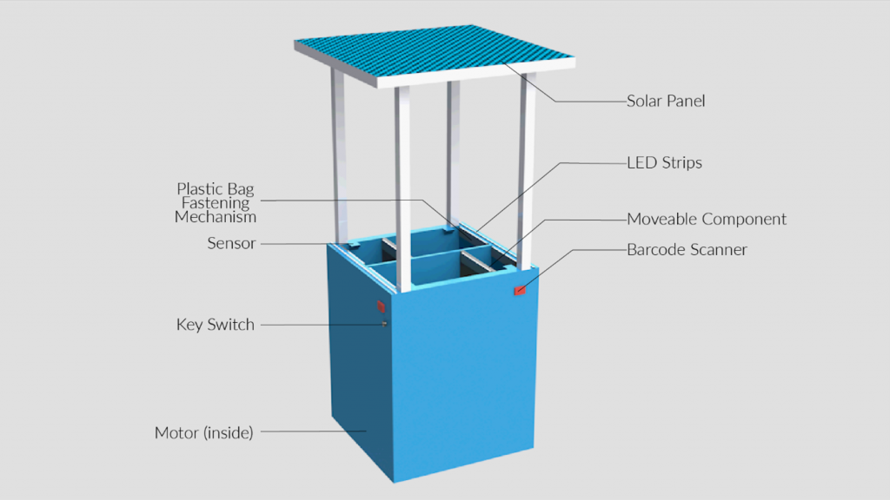

# Recyclace - A Multi-functional Recycling Bin
Recyclace, conceptualised as part of 03.007 Design Thinking and Innovation, is an adaptable and dynamic solution to tackle waste management in this ever-changing environment. With an optimisation feature that adjusts each compartment to ensure maximum utility of the spaces within, it aims to increase the efficiency of recycling. A comfortable height and width allow users to easily access all compartments and barcode scanners on all sides helps to simplify the recycling process for users, reducing doubt and uncertainty during recycling.

## Problem

The COVID-19 pandemic has brought about a new paradigm, where governmental rules and regulations are ever-changing. While many areas of society are constantly adapting to new rules and norms, one aspect that has been overlooked is waste management and recycling. There is a lack of innovation to adapt to the varying types of waste generated over time.

Recycling bins are unable to adapt to the change in proportion of recyclables being thrown, resulting in the bins being filled unevenly. This increases the number of times cleaners have to clear the bin, an interaction which should be reduced.

Furthermore, when doing further study, we found that people are often unaware of what can be recycled, discouraging them from recycling.

Recyclace aims to address these issue, providing an adaptable and dynamic solution to tackle waste management in this ever-changing environment. 

## Solution

Users can scan the barcode labels found on their waste at the barcode scanner and the corresponding LED strip on the corresponding compartment will light up. When the barcode is scanned, the barcode data will be received by the Raspberry Pi Zero W. This barcode will be run through the database (`data.csv`) to check its classification. Future implementation can migrate this database to a cloud database. After classification, the corresponding LED strip will blink.

As the bin fills up, a time-of-flight sensor (VL53L0X) will collect data on the status of the bin. In our prototype, this data is collected as a proof-of-concept, however future implementation will incorporate this data in calculating the optimum volume of each compartment.

When the bin is filled, cleaners will remove the bags of waste from the bin before turning the keylock switch. This will activate the optimisation of compartments, where stepper motors (controlled via TB6600 motor driver) will adjust the dividing compartments to change the volume of the compartments. After optimisation, cleaners will be able to attach new plastic linings to the compartments. With such a mechanism, the bin will optimise over time, reducing the cleaning frequency and increasing the efficiency of recycling.

## Technical Details

### Testing mode
For testing without barcode scanner, set `$recyclace=testing`

### Hardware Wiring
#### Raspberrypi Pinout

#### Pololu VL53L0X TOF sensor
| Raspberry Pi | Sensor |
| ------------ | ------ |
| 3.3V | VIN |
| GND | GND |
| SCL | SCL |
| SDA | SDA |

#### Stepper Motor Driver TB6600
| Raspberry Pi                | TB6600 |
| --------------------------- | ------ |
| GPIO 17                     | ENA-   |
| 3.3V                        | ENA+   |
| GPIO 27                     | DIR-   |
| 3.3V                        | DIR+   |
| GPIO 22                     | PUL-   |
| 3.3V                        | PUL+   |
| - (Connect to motor yellow) | B-     |
| - (Connect to motor red)    | B+     |
| - (Connect to motor green)  | A-     |
| - (Connect to motor blue)   | A+     |
| 12V Power Supply            | VCC    |
| GND                         | GND    |

####  LED Strips
| Raspberry Pi                | LED |
| --------------------------- | ------ |
| GPIO 16                     | RED- (via 10k resistor) |
| GPIO 26                     | BLUE- (via 10k resistor) |
| GPIO 19                     | YELLOW- (via 10k resistor) |
| GPIO 20                     | GREEN- (via 10k resistor) |

#### Keylock Switch
| Raspberry Pi                | Switch |
| --------------------------- | ------ |
| GPIO 14                     | Terminal A |
| 3.3V                        | Terminal B |

#### VL53L0X Sensor
| Raspberry Pi                | VL53L0X |
| --------------------------- | ------ |
| 3.3V                        | VIN |
| GND                         | GND |
| SDA                         | SDA |
| SCL                         | SCL |

### Files
data.csv - Barcode database of items

### VL53L0X Sensor Testing
`/VL53L0X_rasp` - API port for Raspberry Pi (Initialise using `git submodule init` and `git submodule update`)

### References

*Read barcode data: https://www.raspberrypi.org/forums/viewtopic.php?t=55100*

*Stepper motor driver: https://www.instructables.com/Raspberry-Pi-Python-and-a-TB6600-Stepper-Motor-Dri/*

## Team

*Special thanks to Prof Javier Fernandez and Ar. Bianca Gill for their advice and guidance during this project.*

Ian Goh - Software & Electrical

Joyce Lim - Mechanical

Hayden Ang - Mechanical

Fan Cheng - Support

